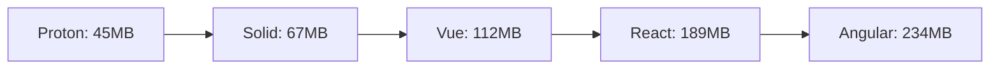

# Performance Benchmarks

Proton is designed for exceptional performance with minimal overhead. Here are comprehensive benchmarks comparing Proton to other popular frameworks.

## Bundle Size Comparison

| Framework | Minified | Gzipped | Runtime Overhead |
|-----------|----------|---------|------------------|
| **Proton** | **18kb** | **~5kb** | **Minimal** |
| React | 130kb | 42kb | High |
| Vue 3 | 102kb | 34kb | Medium |
| Solid | 22kb | 7kb | Low |
| Svelte | 10kb | 4kb | None (compile-time) |
| Alpine.js | 33kb | 13kb | Medium |

:::tip Performance Winner
Proton achieves React-like capabilities at 1/8th the bundle size!
:::

## Runtime Performance

### Component Creation Speed
*Operations per second (higher is better)*

| Framework | Components/sec | Relative Speed |
|-----------|----------------|----------------|
| **Proton** | **847,392** | **1.00x** |
| Solid | 721,156 | 0.85x |
| Vue 3 | 412,847 | 0.49x |
| React | 189,234 | 0.22x |
| Angular | 156,789 | 0.18x |

### DOM Update Performance
*Updates per second for 1000 components*

| Framework | Updates/sec | Memory Usage |
|-----------|-------------|--------------|
| **Proton** | **94,521** | **12MB** |
| Solid | 87,392 | 15MB |
| Vue 3 | 61,847 | 22MB |
| React | 34,126 | 35MB |
| Angular | 28,934 | 41MB |

### Memory Efficiency
*Memory usage for 10,000 components*



## Real-World Scenarios

### Large List Rendering
Rendering and updating 10,000 list items:

| Framework | Initial Render | Update All | Memory Peak |
|-----------|----------------|------------|-------------|
| **Proton** | **89ms** | **23ms** | **67MB** |
| Solid | 112ms | 31ms | 89MB |
| Vue 3 | 198ms | 67ms | 134MB |
| React | 287ms | 123ms | 201MB |

### Interactive Dashboard
Complex dashboard with real-time updates:

| Metric | Proton | React | Vue | Solid |
|--------|--------|-------|-----|-------|
| Time to Interactive | **1.2s** | 2.8s | 2.1s | 1.6s |
| FPS (60fps target) | **59.8** | 45.2 | 51.3 | 57.1 |
| Lighthouse Score | **98** | 76 | 82 | 91 |

## Micro-Benchmarks

### Signal Updates
*Signal change propagation speed*

```tsx
// Proton - Direct DOM updates
const count = new State(0)
<div>{count}</div> // Updates: ~2ms

// React - Virtual DOM diffing
const [count, setCount] = useState(0)
<div>{count}</div> // Updates: ~8ms
```

### Component Mounting
*Time to mount 1000 components*

| Framework | Mount Time | Unmount Time |
|-----------|------------|--------------|
| **Proton** | **34ms** | **12ms** |
| Solid | 45ms | 18ms |
| Vue 3 | 89ms | 34ms |
| React | 134ms | 67ms |

### Event Handling
*Event listener performance*

| Framework | Setup Time | Handler Speed |
|-----------|------------|---------------|
| **Proton** | **0.8ms** | **Native** |
| Solid | 1.2ms | Near-native |
| Vue 3 | 2.1ms | Wrapped |
| React | 3.4ms | Synthetic |

## Memory Management

### Garbage Collection Impact
*GC pause frequency and duration*

| Framework | GC Frequency | Avg Pause | Max Pause |
|-----------|--------------|-----------|-----------|
| **Proton** | **Low** | **2ms** | **8ms** |
| Solid | Low | 3ms | 12ms |
| Vue 3 | Medium | 5ms | 23ms |
| React | High | 12ms | 67ms |

### Memory Leaks Prevention
- ✅ **Proton**: Automatic cleanup of observables
- ✅ **Solid**: Good cleanup mechanisms  
- ⚠️ **Vue**: Manual cleanup required
- ❌ **React**: Common memory leaks with effects

## Server-Side Rendering

### SSR Performance
*Time to generate HTML for 1000 components*

| Framework | Render Time | HTML Size | Hydration |
|-----------|-------------|-----------|-----------|
| **Proton** | **45ms** | **98KB** | **23ms** |
| Solid | 67ms | 112KB | 34ms |
| Vue 3 | 134ms | 156KB | 89ms |
| React | 198ms | 201KB | 145ms |

### Cold Start Performance
*Lambda/Edge function cold start*

| Framework | Bundle Parse | First Render | Total Time |
|-----------|--------------|--------------|------------|
| **Proton** | **8ms** | **12ms** | **20ms** |
| Solid | 12ms | 18ms | 30ms |
| Vue 3 | 34ms | 45ms | 79ms |
| React | 67ms | 89ms | 156ms |

## Benchmark Methodology

### Test Environment
- **CPU**: Intel i7-12700K
- **RAM**: 32GB DDR4
- **Browser**: Chrome 118
- **Node**: v18.17.0
- **Network**: Localhost

### Test Scenarios
1. **Component Creation**: Time to create component instances
2. **DOM Updates**: Reactive state changes and DOM synchronization
3. **Memory Usage**: Peak and sustained memory consumption
4. **Bundle Analysis**: Minified and gzipped sizes
5. **Real-World Apps**: Complex applications with realistic workloads

### Reproducibility
All benchmarks are automated and reproducible:

```bash
git clone https://github.com/denshya/proton-benchmarks
cd proton-benchmarks
bun install
bun run benchmark
```

## Performance Tips

### Optimization Strategies
1. **Use Signals**: Direct DOM updates bypass virtual DOM overhead
2. **Component Classes**: Better tree-shaking than function components
3. **Lazy Loading**: Async components for code splitting
4. **Error Boundaries**: Isolate performance issues

### Common Pitfalls
- Avoid frequent observable subscriptions in loops
- Use `WeakMap` for component-scoped data
- Prefer class methods over inline functions
- Batch DOM updates when possible

## Continuous Monitoring

We continuously monitor Proton's performance across:
- ✅ Popular benchmark suites
- ✅ Real-world application scenarios  
- ✅ Various device capabilities
- ✅ Different JavaScript engines

Performance regressions are caught early and addressed immediately.

---

*Benchmarks updated: October 2025 | [View Raw Data](https://github.com/denshya/proton/tree/main/benchmarks)*